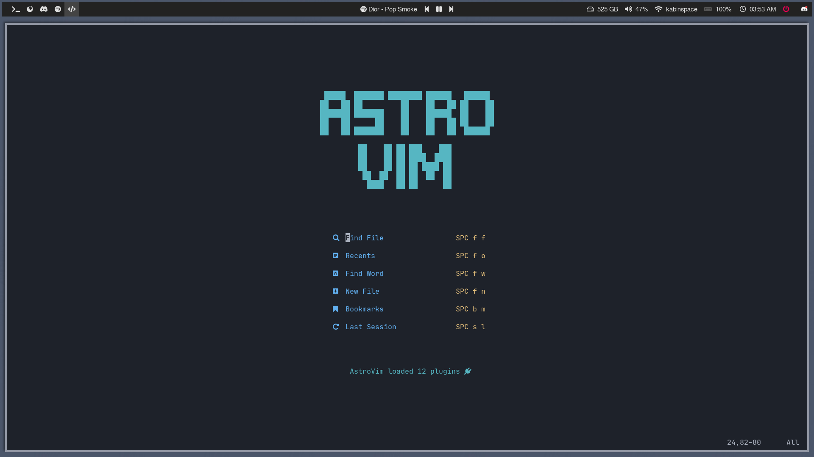

<h1 align="center">AstroVim</h1>

<div align="center"><p>
    <a href="https://github.com/kabinspace/AstroVim/pulse">
      
    </a>
    <a href="https://github.com/kabinspace/AstroVim/blob/main/LICENSE">
      
	</a>
    <a href="https://neovim.io/">
      
    </a>
    <a href="https://discord.gg/UcZutyeaFW">
      
    </a>
</p>
</div>

<p align="center">
AstroVim is an aesthetic and feature-rich neovim config that is extensible and easy to use with a great set of plugins
</p>

## 🌟 Preview



## ⚡ Requirements
* [Nerd Fonts](https://www.nerdfonts.com/font-downloads)
* [Neovim 0.6+](https://github.com/neovim/neovim/releases/tag/v0.6.1)

## 🛠️ Installation
### Linux
#### Make a backup of your current nvim folder
```
mv ~/.config/nvim ~/.config/nvimbackup
```
#### Clone the repository
```
git clone https://github.com/kabinspace/AstroVim ~/.config/nvim
nvim +PackerSync
```

## 📦 Setup

#### Install LSP

Enter `:LspInstall` followed by the name of the server you want to install<br>
Example: `:LspInstall pyright`

#### Install language parser

Enter `:TSInstall` followed by the name of the language you want to install<br>
Example: `:TSInstall python`

#### Manage plugins

Run `:PackerClean` to remove any disabled or unused plugins<br>
Run `:PackerSync` to update and clean plugins<br>

#### Update AstroVim

Run `:AstroUpdate` to get the latest updates from the repository<br>

## ✨ Features

- File explorer with [Nvimtree](https://github.com/kyazdani42/nvim-tree.lua)
- Autocompletion with [Cmp](https://github.com/hrsh7th/nvim-cmp)
- Git integration with [Gitsigns](https://github.com/lewis6991/gitsigns.nvim)
- Statusline with [Lualine](https://github.com/nvim-lualine/lualine.nvim)
- Terminal with [Toggleterm](https://github.com/akinsho/toggleterm.nvim)
- Fuzzy finding with [Telescope](https://github.com/nvim-telescope/telescope.nvim)
- Syntax highlighting with [Treesitter](https://github.com/nvim-treesitter/nvim-treesitter)
- Formatting and linting with [Null-ls](https://github.com/jose-elias-alvarez/null-ls.nvim)
- Language Server Protocol with [Native LSP](https://github.com/neovim/nvim-lspconfig)

## ⚙️ Configuration

[User](https://github.com/kabinspace/AstroVim/blob/main/lua/user) directory is given for custom configuration

```lua
-- Set colorscheme
colorscheme = "onedark",

-- Add plugins
plugins = {
  { "andweeb/presence.nvim" },
  {
    "ray-x/lsp_signature.nvim",
    event = "BufRead",
    config = function()
      require("lsp_signature").setup()
    end,
  },
},

-- Overrides
overrides = {
  treesitter = {
    ensure_installed = { "lua" },
  },
},

-- On/off virtual diagnostics text
virtual_text = true,

-- Set options
set.relativenumber = true

-- Set key bindings
map("n", "<C-s>", ":w!<CR>", opts)

-- Set autocommands
vim.cmd [[
  augroup packer_conf
    autocmd!
    autocmd bufwritepost plugins.lua source <afile> | PackerSync
  augroup end
]]

-- Add formatters and linters
-- https://github.com/jose-elias-alvarez/null-ls.nvim
null_ls.setup {
  debug = false,
  sources = {
    -- Set a formatter
    formatting.rufo,
    -- Set a linter
    diagnostics.rubocop,
  },
  -- NOTE: You can remove this on attach function to disable format on save
  on_attach = function(client)
    if client.resolved_capabilities.document_formatting then
      vim.cmd "autocmd BufWritePre <buffer> lua vim.lsp.buf.formatting_sync()"
    end
  end,
}
```

## Extending AstroVim

AstroVim should allow you to extend its functionality without going outside of the `user` directory!

Please get in contact when you run into some setup issue where that is not the case.

### Add more Plugins

Just copy the `packer` configuration without the `use` and with a `,` after the last closing `}` into the `plugins` key of your `user/settings.lua` file.

See the example above.

### Adding sources to `nvim-cmp`

To add new completion sources to `nvim-cmp` you can add the plugin (see above) providing that source like this:

```lua
    {
      "Saecki/crates.nvim",
      after = "nvim-cmp",
      config = function()
        require("crates").setup()

        local cmp = require "cmp"
        local config = cmp.get_config()
        table.insert(config.sources, { name = "crates" })
        cmp.setup(config)
      end,
    },
```

Use the options provided by `nvim-cmp` to change the order, etc. as you see fit.

### Compley LSP server setup

Some plugins need to do special magic to the LSP configuration to enable advanced features. One example for this is the `rust-tools.nvim` plugin.

Those can override `overrides.lsp_installer.server_registration_override`.

For example the `rust-tools.nvim` plugin can be set up like this:

```lua
    -- Plugin definition:
    {
      "simrat39/rust-tools.nvim",
      requires = { "nvim-lspconfig", "nvim-lsp-installer", "nvim-dap", "Comment.nvim" },
      -- Is configured via the server_registration_override installed below!
    },
```

and then wired up with:

```lua
  overrides = {
    lsp_installer = {
      server_registration_override = function(server, server_opts)
        -- Special code for rust.tools.nvim!
        if server.name == "rust_analyzer" then
          local extension_path = vim.fn.stdpath "data" .. "/dapinstall/codelldb/extension/"
          local codelldb_path = extension_path .. "adapter/codelldb"
          local liblldb_path = extension_path .. "lldb/lib/liblldb.so"

          require("rust-tools").setup {
            server = server_opts,
            dap = {
              adapter = require("rust-tools.dap").get_codelldb_adapter(codelldb_path, liblldb_path),
            },
          }
        else
          server:setup(server_opts)
        end
      end,
    },
  },
```

## 🗒️ Note

[Guide](https://github.com/kabinspace/AstroVim/blob/main/utils/userguide.md) is given for basic usage<br>
[Learn](https://github.com/kabinspace/AstroVim/blob/main/utils/mappings.txt) more about the default key bindings<br>
[Watch](https://www.youtube.com/watch?v=JQLZ7NJRTEo&t=4s&ab_channel=JohnCodes) a review video to know about the out of the box experience

## ⭐ Credits

Sincere appreciation to the following repositories, plugin authors and the entire neovim community out there that made the development of AstroVim possible.

- [Plugins](https://github.com/kabinspace/AstroVim/blob/main/utils/plugins.txt)
- [NvChad](https://github.com/NvChad/NvChad)
- [LunarVim](https://github.com/LunarVim)
- [CosmicVim](https://github.com/CosmicNvim/CosmicNvim)

<div align="center" id="madewithlua">

[](https://lua.org)

</div>
