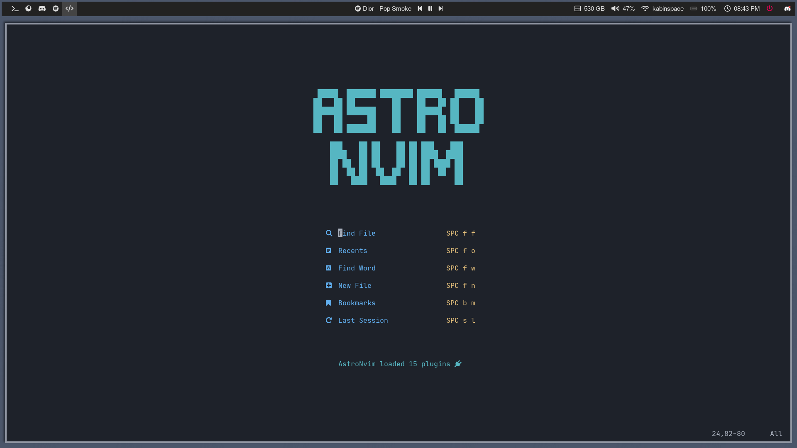
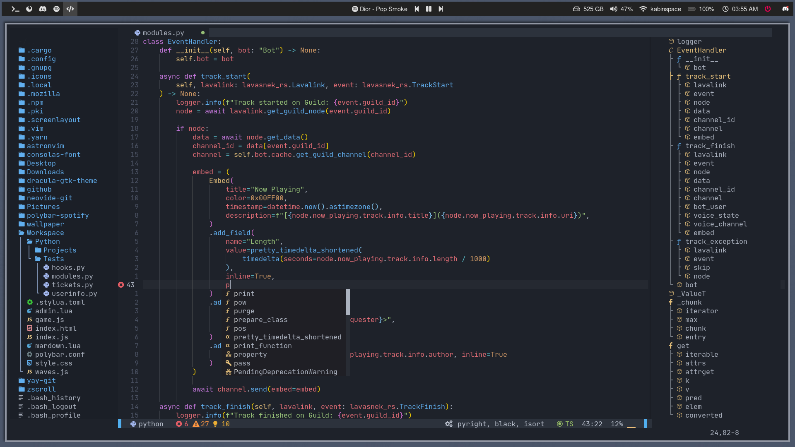
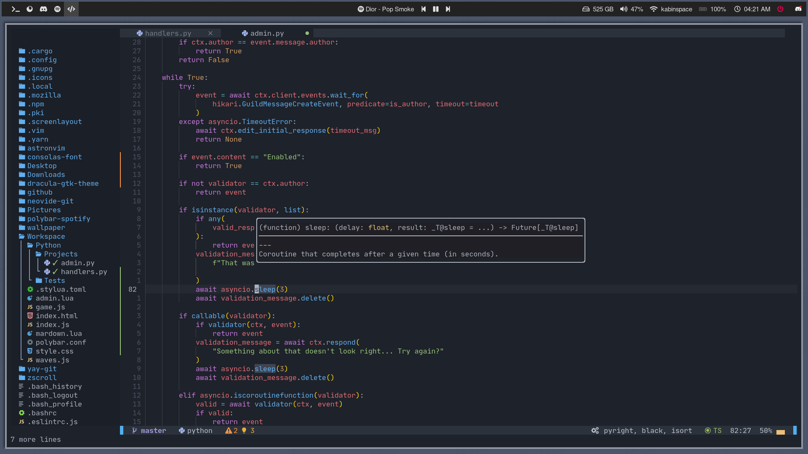

<div align="center" id="madewithlua">
    
</div>

<h1 align="center">AstroNvim</h1>

<div align="center"><p>
    <a href="https://github.com/AstroNvim/AstroNvim/pulse">
      
    </a>
    <a href="https://github.com/AstroNvim/AstroNvim/blob/main/LICENSE">
      
	</a>
    <a href="https://neovim.io/">
      
    </a>
    <a href="https://discord.gg/UcZutyeaFW">
      
    </a>
</p>
</div>

<p align="center">
AstroNvim is an aesthetic and feature-rich neovim config that is extensible and easy to use with a great set of plugins
</p>

**REBRANDING NOTICE:** AstroVim will now be known as AstroNvim to clear up any confusion surrounding this being a Neovim configuration vs a Vim configuration. If you have used AstroNvim before the rebranding please run the following command to update your installation repo:

```sh
git -C ~/.config/nvim remote set-url origin https://github.com/AstroNvim/AstroNvim.git
```

> **Pre-v1.0 Notice:** If you were using AstroVim before the v1.0 release, please see the updated documentation because there were breaking changes.

## 🌟 Preview





## ✨ Features

- File explorer with [Neo-tree](https://github.com/nvim-neo-tree/neo-tree.nvim)
- Autocompletion with [Cmp](https://github.com/hrsh7th/nvim-cmp)
- Git integration with [Gitsigns](https://github.com/lewis6991/gitsigns.nvim)
- Statusline with [Lualine](https://github.com/nvim-lualine/lualine.nvim)
- Terminal with [Toggleterm](https://github.com/akinsho/toggleterm.nvim)
- Fuzzy finding with [Telescope](https://github.com/nvim-telescope/telescope.nvim)
- Syntax highlighting with [Treesitter](https://github.com/nvim-treesitter/nvim-treesitter)
- Formatting and linting with [Null-ls](https://github.com/jose-elias-alvarez/null-ls.nvim)
- Language Server Protocol with [Native LSP](https://github.com/neovim/nvim-lspconfig)

## ⚡ Requirements

- [Nerd Fonts](https://www.nerdfonts.com/font-downloads)
- [Neovim 0.7+](https://github.com/neovim/neovim/releases/tag/v0.7.0)
- Terminal with true color support (for the default theme, otherwise it is dependent on the theme you are using)
- Optional Requirements:
  - [fzf](https://github.com/junegunn/fzf) - live grep telescope search (`<leader>fw`)
  - [lazygit](https://github.com/jesseduffield/lazygit) - git ui toggle terminal (`<leader>tl` or `<leader>gg`)
  - [NCDU](https://dev.yorhel.nl/ncdu) - disk usage toggle terminal (`<leader>tu`)
  - [Htop](https://htop.dev/) - process viewer toggle terminal (`<leader>tt`)
  - [Python](https://www.python.org/) - python repl toggle terminal (`<leader>tp`)
  - [Node](https://nodejs.org/en/) - node repl toggle terminal (`<leader>tn`)

> Note when using default theme: For MacOS, the default terminal does not have true color support. You wil need to use [iTerm2](https://iterm2.com/) or another [terminal emulator](https://gist.github.com/XVilka/8346728#terminal-emulators) that has true color support.

> Note if you are still on Neovim v0.6: You can still install the previous version of AstroNvim that supported. After cloning the repository run `git checkout nvim-0.6` to check out this version. This will no longer be receiving updates.

## 🛠️ Installation

#### Make a backup of your current nvim folder

```
mv ~/.config/nvim ~/.config/nvimbackup
```

#### Clone the repository

```
git clone https://github.com/AstroNvim/AstroNvim ~/.config/nvim
nvim +PackerSync
```

## 📦 Basic Setup

#### Install LSP

Enter `:LspInstall` followed by the name of the server you want to install<br>
Example: `:LspInstall pyright`

#### Install language parser

Enter `:TSInstall` followed by the name of the language you want to install<br>
Example: `:TSInstall python`

#### Manage plugins

Run `:PackerClean` to remove any disabled or unused plugins<br>
Run `:PackerSync` to update and clean plugins<br>

#### Update AstroNvim

Run `:AstroUpdate` to get the latest updates from the repository<br>

## 🗒️ Links

[AstroNvim Documentation](https://astronvim.github.io/)

- [Basic Usage](https://astronvim.github.io/usage/walkthrough) is given for basic usage
- [Default Mappings](https://astronvim.github.io/usage/mappings) more about the default key bindings
- [Default Plugin Configuration](https://astronvim.github.io/configuration/plugin_defaults) more about the provided plugin defaults
- [Advanced Configuration](https://astronvim.github.io/configuration/config_options) more about advanced configuration

[Watch](https://www.youtube.com/watch?v=JQLZ7NJRTEo&t=4s&ab_channel=JohnCodes) a review video to know about the out of the box experience

## ⭐ Credits

Sincere appreciation to the following repositories, plugin authors and the entire neovim community out there that made the development of AstroNvim possible.

- [Plugins](https://astronvim.github.io/acknowledgements#plugins-used-in-astronvim)
- [NvChad](https://github.com/NvChad/NvChad)
- [LunarVim](https://github.com/LunarVim)
- [CosmicVim](https://github.com/CosmicNvim/CosmicNvim)

<div align="center" id="madewithlua">

[](https://lua.org)

</div>
